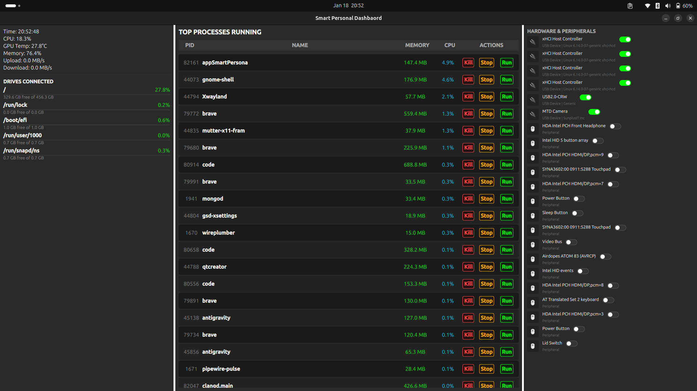

# Smart Personal Dashboard

A modern, high-performance system monitoring dashboard built with Qt 6 and C++. This application provides real-time insights into your system's health, including CPU usage, GPU temperature, memory consumption, network speeds, and process management.



## 🚀 Features

- **Real-time Metrics**: Monitor CPU, GPU, and Memory usage with live updates.
- **Network Monitoring**: Track upload and download speeds in real-time.
- **Process Management**: View active processes and manage them (Kill/Suspend).
- **Hardware Insights**: Detailed information about connected drives and hardware components.
- **Modern UI**: Sleek, responsive interface built with QML and custom components.

## 🛠️ Tech Stack

- **Core**: C++ 20
- **Framework**: [Qt 6.8+](https://www.qt.io/)
- **UI/UX**: QML (Qt Quick)
- **Build System**: CMake
- **Platform**: Linux (Optimized for sysfs/procfs interactions)

## 📂 Project Structure

- `Backend/`: C++ logic for system metrics collection (`MetricsService`).
- `UI/`: QML components for the dashboard layout.
- `Main.qml`: Main application window and entry point for the UI.
- `main.cpp`: Application initialization and C++/QML integration.

## 🏗️ Getting Started

### Prerequisites

- Qt 6.8 or higher
- CMake 3.16+
- A C++20 compatible compiler (GCC/Clang)

### Build Instructions

1. Clone the repository:
   ```bash
   git clone <repository-url>
   cd SmartPersonalDashboard
   ```

2. Create a build directory and compile:
   ```bash
   mkdir build && cd build
   cmake ..
   make
   ```

3. Run the application:
   ```bash
   ./appSmartPersonalDashboard
   ```

## 📄 License

This project is licensed under the MIT License - see the LICENSE file for details.
