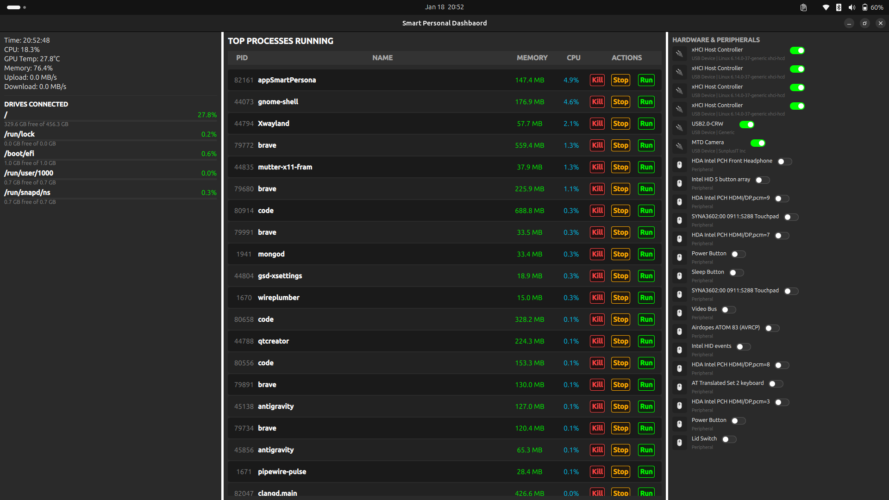

# Smart Personal Dashboard

A modern, high‑performance system‑monitoring dashboard built with **Qt 6** and C++. The application provides real‑time insight into system health and lets you interact with processes, files, and system calls.



---

## 🚀 Features

- **Real‑time Metrics** – CPU, GPU temperature, memory usage, and network throughput updated every seconds.
- **Process Management** – List all processes, search/filter, kill, suspend/resume, and **trace** syscalls of any PID.
- **File‑Watcher** – Detects file/create/modify/delete events across the filesystem and shows the originating process.
- **Syscall Tracer** – Live view of system calls (open, read, write, execve, connect, mmap, …) with colour‑coded categories.
- **Seccomp Export** – One‑click generation of a Docker‑compatible JSON seccomp policy containing all observed syscalls.
- **Modern UI** – Dark, glass‑morphism inspired QML interface with smooth animations, search bar, pause button and vertical scrollbar for stable scrolling.
- **Exportable Logs** – Capture syscall logs to a file for offline analysis.

---

## 🛠️ Tech Stack

- **Core Language**: C++ 20
- **Framework**: Qt 6.8+ (QtQuick, QtQuickControls, QtQuickLayouts)
- **UI**: QML (Qt Quick) with custom components
- **Build System**: CMake
- **Platform**: Linux (uses `/proc`, `/sys`, and ptrace APIs)

---

## 📂 Project Structure

```
SmartPersonalDashboard/
├─ Backend/                # C++ services
│   ├─ metricsservice.h/cpp   # System metrics collection
│   ├─ FileWatcherService.h/cpp# File event monitoring
│   ├─ SyscallTracerService.h/cpp # Ptrace worker, decoding, seccomp export
│   └─ SyscallTable.h          # Syscall number → name/category mapping
├─ UI/                     # QML UI components
│   ├─ CenterComponent.qml   # Main dashboard (process list, search, pause)
│   ├─ FileWatcherTab.qml    # File‑watcher UI tab
│   └─ SyscallTracerTab.qml  # Syscall tracer UI tab
├─ Main.qml                # Root QML file – TabBar & StackLayout
├─ main.cpp                # Application entry point & service registration
├─ CMakeLists.txt          # Build configuration
└─ README.md               # Documentation (this file)
```

---

## 📦 Getting Started

### Prerequisites

- Qt 6.8 or newer (including QtQuick modules)
- CMake ≥ 3.16
- A C++20‑compatible compiler (GCC ≥ 10 or Clang ≥ 12)
- Linux kernel with `/proc` and `/sys` access (required for metrics & ptrace)

### Build Instructions

```bash
# 1️⃣ Clone the repo
git clone https://github.com/yourusername/SmartPersonalDashboard.git
cd SmartPersonalDashboard

# 2️⃣ Create a build directory
mkdir build && cd build

# 3️⃣ Configure with CMake
cmake ..

# 4️⃣ Compile
cmake --build . --parallel
```

The executable will be created at `./build/appSmartPersonalDashboard`.

---

## ▶️ Running the Application

```bash
# Normal run (no root required)
./build/appSmartPersonalDashboard
```

### Command‑line tracing shortcut

You can launch and automatically trace a binary directly from the command line:

```bash
./build/appSmartPersonalDashboard --trace /bin/ls --trace-args "-la"
```
The app starts headlessly (`-platform offscreen`) and prints syscall logs to `syscall_trace.log`.

---

## 🔧 Using the Dashboard

### 1. Process List (Top Processes)
- **Search bar** – type a PID or process name to filter.
- **Pause button** – freeze live updates while you scroll.
- **Actions per row**:
  - **Kill** – send `SIGKILL`.
  - **Stop / Run** – suspend (`SIGSTOP`) or resume (`SIGCONT`).
  - **Trace** – open the *Syscall Tracer* tab and attach to that PID.

### 2. File‑Watcher Tab
- Shows file events (`READ`, `WRITE`, `CREATE`, `DELETE`).
- Each entry includes the originating PID, process name, and file path.
- Useful for debugging background daemons or watching a download folder.

### 3. Syscall Tracer Tab
- **Launch & Trace** – provide a binary path and args, the dashboard forks and traces the child.
- **Attach to PID** – enter an existing PID and click *Attach*.
- **Export Seccomp** – press the button to generate `seccomp‑policy.json` containing every unique syscall observed during the session.
- **Colour‑coding** (by category):
  - `file` – cyan `#00ccff`
  - `network` – orange `#ffa500`
  - `process` – green `#00ff00`
  - `memory` – purple `#c71585`
  - `signal` – blue `#1e90ff`
  - `other` – grey `#aaaaaa`

#### Security note – attaching to arbitrary processes
Linux’s **Yama** security module restricts `ptrace` when `/proc/sys/kernel/yama/ptrace_scope` is set to `1` (the default on many distros). In that mode only a parent may attach to its child.

- **Option A – Temporary lift**:
  ```bash
  sudo sysctl -w kernel.yama.ptrace_scope=0   # disables the restriction until reboot
  ```
- **Option B – Run as root**:
  ```bash
  sudo ./build/appSmartPersonalDashboard
  ```
- **Option C – UI helper** (future work): a button that runs the above command after user confirmation.

After the restriction is relaxed, the *Attach* field works for any user‑owned process.

---

## 📂 Exported Files
- `syscall_trace.log` – raw log of captured syscalls (generated by the CLI trace mode).
- `seccomp-policy.json` – Docker‑compatible seccomp profile (exported from the tracer UI).

---

## 🤝 Contributing

Contributions are welcome! Feel free to open issues or submit pull requests.

### Development guidelines
1. Follow the existing coding style (C++20, Qt signal/slot conventions, QML idioms).
2. Keep UI elements responsive – avoid long‑running work on the GUI thread.
3. Add unit tests for new C++ logic where appropriate.
4. Update this README when you add new features.

---

## 📜 License

This project is licensed under the **MIT License** – see the `LICENSE` file for details.

---

## 📞 Contact

For questions or suggestions, open an issue on GitHub or contact the maintainer at `harshittext@gmail.com`.
